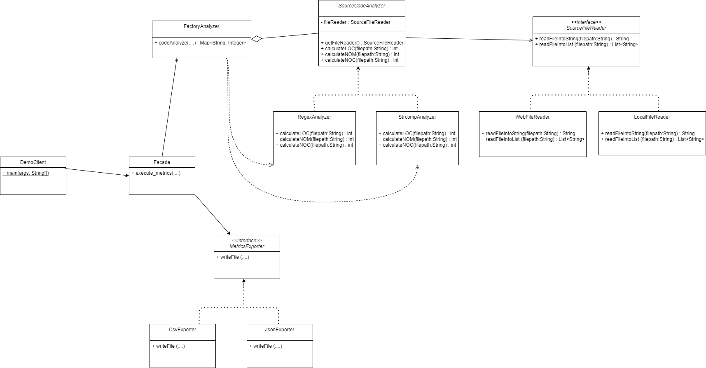

# Design Patterns Assignment

This module contains the redesign of a system based on the SOLID design principles by applying the appropriate design patterns. The assignment description can be found [here](https://edu.dmst.aueb.gr/pluginfile.php/19938/mod_resource/content/1/Lab-Assignment-4.pdf).

## Running the system

1. Build the executable Java application with: 
	mvn package jacoco:report

2. Run the executable by executing
	java –jar “jar-with-dependencies” arg0 arg1 arg2 arg3 arg4
were args translate to: 	
	arg0 = “JavaSourceCodeInputFile” (e.g., src/test/resources/TestClass.java)
	arg1 = “sourceCodeAnalyzerType” [regex|strcomp]
	arg2 = “SourceCodeLocationType” [local|web]
	arg3 = “OutputFilePath” (e.g., ../output_metrics_file)
	arg4 = “OutputFileType” [csv|json]
example: 
	java –jar ./target/sourcecodeanalyzer-0.0.1-SNAPSHOT-jar-with-dependencies.jar ./src/test/resources/TestClass.java regex local metrics_results csv
	
## System Class Diagram

